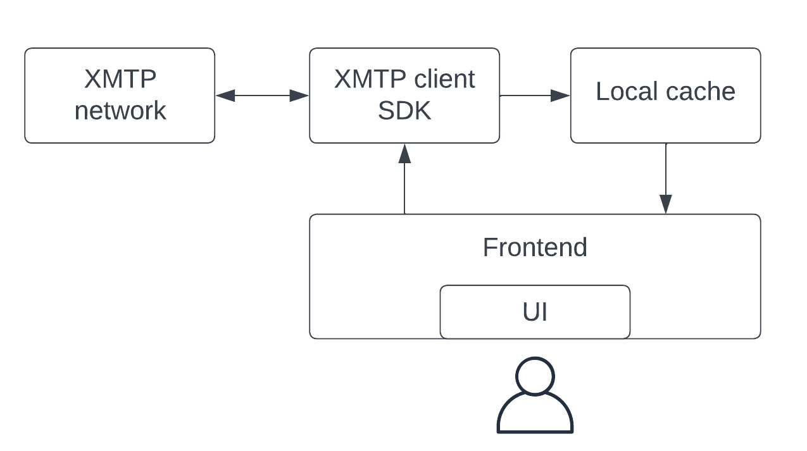

# React XMTP client SDK


This package provides the XMTP client SDK for React.

To keep up with the latest SDK developments, see the [Issues tab](https://github.com/xmtp/xmtp-web/issues) in this repo.

To learn more about XMTP and get answers to frequently asked questions, see the [XMTP documentation](https://xmtp.org/docs).

## What's inside?

### Hooks

These hooks are mostly bindings to the [`xmtp-js` SDK](https://github.com/xmtp/xmtp-js) that expose the underlying data in a React way.

## Requirements

- Node 18+
- React 16.14+

## Install

```bash
# npm
npm install @xmtp/react-sdk

# pnpm
pnpm install @xmtp/react-sdk

# yarn
yarn add @xmtp/react-sdk
```

### Create React App

Requires the Buffer polyfill. See below.

If you see a lot of warnings related to source maps, see [this issue](https://github.com/facebook/create-react-app/discussions/11767) to learn more.

### Vite

Requires the Buffer polyfill. See below.

### Buffer polyfill

The Node Buffer API must be polyfilled in some cases. To do so, add the `buffer` dependency to your project and then polyfill it in your entry file.

**Example**

```tsx
import { Buffer } from "buffer";

window.Buffer = window.Buffer ?? Buffer;
```

## Reference docs

Access the XMTP React SDK [reference documentation](https://xmtp.github.io/xmtp-web/).

## Local-first architecture

This client SDK uses a local-first architecture to help you build a production-grade and performant app. Using this local-first architecture, the client prioritizes using the local cache on the device where it’s running.

For example, the client initially retrieves existing message data from the XMTP network and places it in the device’s local cache. As needed, the client asynchronously loads new and updated message data to the local cache. You then build your app to get message data from the local cache, which provides faster load times than getting data directly from the XMTP network.

Here’s an overview of how your app frontend, local cache, client SDK, and the XMTP network work together in this local-first approach:



## Usage

### Add the provider

To use the provided hooks, you must wrap your app with an `XMTPProvider`. This gives the hooks access to the XMTP client instance.

> **Note**  
> There’s only one client instance per provider.

**Example**

```tsx
import { XMTPProvider } from "@xmtp/react-sdk";

createRoot(document.getElementById("root") as HTMLElement).render(
  <StrictMode>
    <XMTPProvider>
      <App />
    </XMTPProvider>
  </StrictMode>,
);
```

### Create a client

The `useClient` hook allows you to initialize, access, and disconnect the XMTP client instance. It also exposes the error and loading states of the client.

Initializing the client requires passing in a connected wallet that implements the [Signer](https://github.com/xmtp/xmtp-js/blob/main/src/types/Signer.ts) interface.

**Type**

```tsx
import { Client } from "@xmtp/react-sdk";

type InitClientArgs = {
  keys?: Uint8Array;
  options?: Partial<ClientOptions>;
  signer?: Signer | null;
};

const useClient: () => {
  client: Client | undefined;
  disconnect: () => void;
  error: unknown;
  initialize: (args?: InitClientArgs) => Promise<void>;
  isLoading: boolean;
};
```

**Example**

```tsx
export const CreateClient: React.FC<{ signer: Signer }> = ({ signer }) => {
  const { client, error, isLoading, initialize } = useClient();

  const handleConnect = useCallback(async () => {
    await initialize({ signer });
  }, [initialize]);

  if (error) {
    return "An error occurred while initializing the client";
  }

  if (isLoading) {
    return "Awaiting signatures...";
  }

  if (!client) {
    return (
      <button type="button" onClick={handleConnect}>
        Connect to XMTP
      </button>
    );
  }

  return "Connected to XMTP";
};
```

### Configure the client

The client's network connection and key storage method can be configured with these optional parameters of `Client.create`:

| Parameter                 | Default                                                                         | Description                                                                                                                                                                                                                                                                                                                                                                                                                            |
| ------------------------- | ------------------------------------------------------------------------------- | -------------------------------------------------------------------------------------------------------------------------------------------------------------------------------------------------------------------------------------------------------------------------------------------------------------------------------------------------------------------------------------------------------------------------------------- |
| appVersion                | undefined                                                                       | Add a client app version identifier that's included with API requests.<br/>For example, you can use the following format: appVersion: APP_NAME + '/' + APP_VERSION.<br/>Setting this value provides telemetry that shows which apps are using the XMTP client SDK. This information can help XMTP developers provide app support, especially around communicating important SDK updates, including deprecations and required upgrades. |
| env                       | dev                                                                             | Connect to the specified XMTP network environment. Valid values include dev, production, or local. For important details about working with these environments, see [XMTP production and dev network environments](https://github.com/xmtp/xmtp-web/blob/main/packages/react-sdk/README.md#xmtp-production-and-dev-network-environments).                                                                                              |
| apiUrl                    | undefined                                                                       | Manually specify an API URL to use. If specified, value of env will be ignored.                                                                                                                                                                                                                                                                                                                                                        |
| keystoreProviders         | [StaticKeystoreProvider, NetworkKeystoreProvider, KeyGeneratorKeystoreProvider] | Override the default behavior of how the client creates a Keystore with a custom provider. This can be used to get the user's private keys from a different storage mechanism.                                                                                                                                                                                                                                                         |
| persistConversations      | true                                                                            | Maintain a cache of previously seen V2 conversations in the storage provider (defaults to LocalStorage).                                                                                                                                                                                                                                                                                                                               |
| skipContactPublishing     | false                                                                           | Do not publish the user's contact bundle to the network on client creation. Designed to be used in cases where the client session is short-lived (for example, decrypting a push notification), and where it is known that a client instance has been instantiated with this flag set to false at some point in the past.                                                                                                              |
| codecs                    | [TextCodec]                                                                     | Add codecs to support additional content types.                                                                                                                                                                                                                                                                                                                                                                                        |
| maxContentSize            | 100M                                                                            | Maximum message content size in bytes.                                                                                                                                                                                                                                                                                                                                                                                                 |
| preCreateIdentityCallback | undefined                                                                       | preCreateIdentityCallback is a function that will be called immediately before a [Create Identity wallet signature](https://xmtp.org/docs/concepts/account-signatures#sign-to-create-an-xmtp-identity) is requested from the user.                                                                                                                                                                                                     |
| preEnableIdentityCallback | undefined                                                                       | preEnableIdentityCallback is a function that will be called immediately before an [Enable Identity wallet signature](https://xmtp.org/docs/concepts/account-signatures#sign-to-enable-an-xmtp-identity) is requested from the user.                                                                                                                                                                                                    |

## Create a client with private keys

Manually handling private keys is not recommended unless a use case requires it.

The SDK will handle key storage for the user by encrypting the private key bundle using a signature generated from the wallet, and storing the encrypted payload on the XMTP network. This can be awkward for some server-side applications, where you may only want to give the application access to the XMTP keys but not your wallet keys. Mobile applications may also want to store keys in a secure enclave rather than rely on decrypting the remote keys on the network each time the application starts up.

You can export the unencrypted key bundle using the static method `Client.getKeys`, save it somewhere secure, and then provide those keys at a later time to initialize a new client using the exported XMTP identity.

The keys returned by `getKeys` should be treated with the utmost care as compromise of these keys will allow an attacker to impersonate the user on the XMTP network. Ensure these keys are stored somewhere secure and encrypted.

**Example**

```tsx
import { Client, useClient } from "@xmtp/react-sdk";
import type { Signer } from "@xmtp/react-sdk";

export const CreateClientWithKeys: React.FC<{ signer: Signer }> = ({ signer }) => {
  const { initialize } = useClient();

  // initialize client on mount
  useEffect(() => {
    const init = async () => {
      // get the keys using a valid Signer
      const keys = await Client.getKeys(signer);
      // create a client using keys returned from getKeys
      await initialize({ keys, signer });
    };
    void init();
  }, []);

  return (
    ...
  );
};
```

### Check if an address is on the network

The `useCanMessage` hook exposes both the client and static instances of the `canMessage` method. To check if a blockchain address is registered on the network before instantiating a client instance, use the `canMessageStatic` export.

**Type**

```tsx
type NetworkOptions = {
  env: "local" | "dev" | "production";
  apiUrl: string | undefined;
  appVersion?: string;
};

const useCanMessage: () => {
  canMessage: {
    (peerAddress: string): Promise<boolean>;
    (peerAddress: string[]): Promise<boolean[]>;
  };
  canMessageStatic: {
    (peerAddress: string, opts?: Partial<NetworkOptions>): Promise<boolean>;
    (peerAddress: string[], opts?: Partial<NetworkOptions>): Promise<boolean[]>;
  };
};
```

**Example**

```tsx
import { useCanMessage } from "@xmtp/react-sdk";

export const CanMessage: React.FC = () => {
  const [peerAddress, setPeerAddress] = useState("");
  const [isOnNetwork, setIsOnNetwork] = useState(false);
  const [isLoading, setIsLoading] = useState(false);

  const { canMessage } = useCanMessage();

  const handleAddressChange = useCallback((e: React.KeyboardEvent<HTMLInputElement>) => {
    setPeerAddress(e.target.value);
  }, []);

  const handleCheckAddress = useCallback(async (e: FormEvent) => {
      e.preventDefault();
      if (isValidAddress(peerAddress)) {
        setIsLoading(true);
        setIsOnNetwork(await canMessage(peerAddress));
        setIsLoading(false);
      } else {
        setIsOnNetwork(false);
      }
    };
    void checkAddress();
  }, [peerAddress]);

  return (
    <form onSubmit={handleCheckAddress}>
      <input
        name="addressInput"
        type="text"
        onChange={handleAddressChange}
        disabled={isLoading}
      />
    </form>
  );
};
```

## Handle conversations

### List existing conversations

The `useConversations` hook fetches all conversations with the current wallet on mount. It also exposes error and loading states.

**Types**

```tsx
import type { ContentTypeMetadata } from "@xmtp/react-sdk";

type CachedConversation<M = ContentTypeMetadata> = {
  context?: InvitationContext;
  createdAt: Date;
  id?: number;
  isReady: boolean;
  metadata?: M;
  peerAddress: string;
  topic: string;
  updatedAt: Date;
  walletAddress: string;
};

const useConversations: (options?: UseConversationsOptions) => {
  conversations: CachedConversation<ContentTypeMetadata>[];
  error: Error | null;
  isLoading: boolean;
};
```

**Example**

```tsx
export const ListConversations: React.FC = () => {
  const { conversations, error, isLoading } = useConversations();

  if (error) {
    return "An error occurred while loading conversations";
  }

  if (isLoading) {
    return "Loading conversations...";
  }

  return (
    ...
  );
};
```

### Listen for new conversations

The `useStreamConversations` hook listens for new conversations in real-time and calls the passed callback when a new conversation is created. It also exposes an error state.

**Type**

```tsx
import type { Conversation } from "@xmtp/react-sdk";

const useStreamConversations: (
  onConversation: (conversation: Conversation) => void,
) => {
  error: unknown;
};
```

**Example**

```tsx
import { useCallback, useState } from "react";
import { useStreamConversations } from "@xmtp/react-sdk";
import type { Conversation } from "@xmtp/react-sdk";

export const NewConversations: React.FC = () => {
  // track streamed conversations
  const [streamedConversations, setStreamedConversations] = useState<
    Conversation[]
  >([]);

  // callback to handle incoming conversations
  const onConversation = useCallback(
    (conversation: Conversation) => {
      setStreamedConversations((prev) => [...prev, conversation]);
    },
    [],
  );
  const { error } = useStreamConversations(onConversation);

  if (error) {
    return "An error occurred while streaming conversations";
  }

  return (
    ...
  );
};
```

### Start a new conversation

The `useStartConversation` hook starts a new conversation and sends an initial message to it.

**Type**

```tsx
const useStartConversation: (options?: UseStartConversation) => {
    error: unknown;
    isLoading: boolean;
    startConversation: <T = string>(peerAddress: string, content: T, contentType?: ContentTypeId, sendOptions?: SendMessageOptions) => Promise<{
        cachedConversation: CachedConversationWithId | undefined;
        cachedMessage: undefined;
        conversation: undefined;
    } | {
        ...;
    }>;
}
```

**Example**

```tsx
import { isValidAddress, useStartConversation } from "@xmtp/react-sdk";
import { useCallback, useState } from "react";

export const StartConversation: React.FC = () => {
  const [peerAddress, setPeerAddress] = useState("");
  const [message, setMessage] = useState("");
  const [isLoading, setIsLoading] = useState(false);

  const { startConversation } = useStartConversation();

  const handleAddressChange = useCallback(
    (e: ChangeEvent<HTMLInputElement>) => {
      setPeerAddress(e.target.value);
    },
    [],
  );

  const handleMessageChange = useCallback(
    (e: ChangeEvent<HTMLInputElement>) => {
      setMessage(e.target.value);
    },
    [],
  );

  const handleStartConversation = useCallback(
    async (e: React.FormEvent) => {
      e.preventDefault();
      if (peerAddress && message) {
        setIsLoading(true);
        const conversation = await startConversation(peerAddress, message);
        setIsLoading(false);
      }
    },
    [message, peerAddress, startConversation],
  );

  return (
    <form onSubmit={handleStartConversation}>
      <input
        name="addressInput"
        type="text"
        onChange={handleAddressChange}
        disabled={isLoading}
      />
      <input
        name="messageInput"
        type="text"
        onChange={handleMessageChange}
        disabled={isLoading || !isValidAddress(peerAddress)}
      />
    </form>
  );
};
```

## Handle messages

### List messages in a conversation

The `useMessages` hook fetches a list of all messages within a conversation on mount. It also exposes loading and error states and whether there are more messages based on the options passed.

**Types**

```tsx
import type {
  ContentTypeMetadata,
  CachedConversation,
  DecodedMessage,
  SendOptions,
} from "@xmtp/react-sdk";

type CachedMessage<C = any, M = ContentTypeMetadata> = {
  content: C;
  contentBytes?: Uint8Array;
  contentFallback?: string;
  contentType: string;
  conversationTopic: string;
  hasSendError: boolean;
  id?: number;
  isSending: boolean;
  metadata?: M;
  senderAddress: string;
  sendOptions?: SendOptions;
  sentAt: Date;
  status: "unprocessed" | "processed";
  uuid: string;
  walletAddress: string;
  xmtpID: string;
};

type UseMessagesOptions = OnError & {
  /**
   * Callback function to execute when new messages are fetched
   */
  onMessages?: (messages: DecodedMessage[]) => void;
};

const useMessages: (
  conversation: CachedConversation,
  options?: UseMessagesOptions,
) => {
  error: Error | null;
  isLoading: boolean;
  messages: CachedMessage<any, ContentTypeMetadata>[];
};
```

**Example**

```tsx
import { useMessages } from "@xmtp/react-sdk";
import type { CachedConversation } from "@xmtp/react-sdk";

export const Messages: React.FC<{
  conversation: CachedConversation;
}> = ({ conversation }) => {
  const { error, messages, isLoading } = useMessages(conversation);

  if (error) {
    return "An error occurred while loading messages";
  }

  if (isLoading) {
    return "Loading messages...";
  }

  return (
    ...
  );
};
```

### Send messages

The `useSendMessage` hook sends a new message into a conversation.

**Type**

```jsx
import type { DecodedMessage, CachedConversation, SendOptions } from "@xmtp/react-sdk";

const useSendMessage: (options?: UseSendMessageOptions) => {
    error: unknown;
    isLoading: boolean;
    sendMessage: <T = string>(conversation: CachedConversation, content: T, contentType?: ContentTypeId, sendOptions?: Omit<SendOptions, "contentType">) => Promise<DecodedMessage>;
}
```

**Example**

```jsx
import { useSendMessage } from "@xmtp/react-sdk";
import type { Conversation } from "@xmtp/react-sdk";
import { useCallback, useState } from "react";

export const SendMessage: React.FC<{ conversation: CachedConversation }> = ({
  conversation,
}) => {
  const [peerAddress, setPeerAddress] = useState("");
  const [message, setMessage] = useState("");
  const [isSending, setIsSending] = useState(false);
  const sendMessage = useSendMessage();

  const handleAddressChange = useCallback(
    (e: ChangeEvent<HTMLInputElement>) => {
      setPeerAddress(e.target.value);
    },
    [],
  );

  const handleMessageChange = useCallback(
    (e: ChangeEvent<HTMLInputElement>) => {
      setMessage(e.target.value);
    },
    [],
  );

  const handleSendMessage = useCallback(
    async (e: React.FormEvent) => {
      e.preventDefault();
      if (peerAddress && isValidAddress(peerAddress) && message) {
        setIsLoading(true);
        await sendMessage(conversation, message);
        setIsLoading(false);
      }
    },
    [message, peerAddress, sendMessage],
  );

  return (
    <form onSubmit={handleSendMessage}>
      <input
        name="addressInput"
        type="text"
        onChange={handleAddressChange}
        disabled={isSending}
      />
      <input
        name="messageInput"
        type="text"
        onChange={handleMessageChange}
        disabled={isSending}
      />
    </form>
  );
};
```

### Optimistic sending

When a user sends a message with XMTP, they might experience a slight delay between sending the message and seeing their sent message display in their app UI.

This is because when a user sends a message, they typically have to wait for the XMTP network to finish processing the message before the app can display it in the UI.

The local-first architecture of the React SDK automatically includes optimistic sending to immediately display the sent message in the sender’s UI while processing the message in the background. This provides the user with immediate feedback and enables them to continue messaging without having to wait for their previous message to finish processing.

Messages that are in the sending state will have a `true` value for their `isSending` property.

### Handle messages that fail to send

If a message fails to complete the sending process, you must provide an error state that alerts the user and enables them to either resend the message or cancel sending the message.

While in this unsent state, the message remains in its original location in the user’s conversation flow, with any newer sent and received messages displaying after it.

If the user chooses to resend the message, the message moves into the most recently sent message position in the conversation. Once it successfully sends, it remains in that position.

If the user chooses to cancel sending the message, the message is removed from the conversation flow.

Messages that fail to send will have the `hasSendError` property set to `true`.

#### Resend a failed message

Use the `resendMessage` function from the `useResendMessage` hook to resend a failed message.

```tsx
const { resendMessage } = useResendMessage();

// resend the message
resendMessage(failedMessage);
```

### Compression

Message content can be optionally compressed using the `compression` option. The value of the option is the name of the compression algorithm to use. Currently supported are `gzip` and `deflate`. Compression is applied to the bytes produced by the content codec.

Content will be decompressed transparently on the receiving end. Note that `Client` enforces maximum content size. The default limit can be overridden through the `ClientOptions`. Consequently, a message that would expand beyond that limit on the receiving end will fail to decode.

```tsx
import { Compression, ContentTypeText } from "@xmtp/react-sdk";

const sendMessage = useSendMessage();

await sendMessage(conversation, "#".repeat(1000), ContentTypeText, {
  compression: Compression.COMPRESSION_DEFLATE,
});
```

### Listen for new messages in a conversation

The `useStreamMessages` hook streams new conversation messages on mount and exposes an error state.

**Type**

```tsx
import type { CachedConversation } from "@xmtp/react-sdk";

const useStreamMessages: (
  conversation: CachedConversation,
  options?: UseStreamMessagesOptions,
) => {
  error: unknown;
};
```

**Example**

```tsx
import { useStreamMessages } from "@xmtp/react-sdk";
import type { CachedConversation, DecodedMessage } from "@xmtp/react-sdk";
import { useCallback, useEffect, useState } from "react";

export const StreamMessages: React.FC<{
  conversation: CachedConversation;
}> = ({
  conversation,
}) => {
  // track streamed messages
  const [streamedMessages, setStreamedMessages] = useState<DecodedMessage[]>(
    [],
  );

  // callback to handle incoming messages
  const onMessage = useCallback(
    (message: DecodedMessage) => {
      setStreamedMessages((prev) => [...prev, message]);
    },
    [streamedMessages],
  );

  useStreamMessages(conversation, onMessage);

  useEffect(() => {
    setStreamedMessages([]);
  }, [conversation]);

  return (
    ...
  );
};
```

### Listen for new messages in all conversations

The `useStreamAllMessages` hook streams new messages from all conversations on mount and exposes an error state.

**Type**

```tsx
import type { DecodedMessage } from "@xmtp/react-sdk";

const useStreamAllMessages: (
  onMessage: (message: DecodedMessage) => void | Promise<void>,
  onError?: OnError["onError"],
) => {
  error: unknown;
};
```

**Example**

```tsx
import { useStreamAllMessages } from "@xmtp/react-sdk";
import type { DecodedMessage } from "@xmtp/react-sdk";
import { useCallback, useState } from "react";

export const StreamAllMessages: React.FC = () => {
  // track streamed messages
  const [streamedMessages, setStreamedMessages] = useState<DecodedMessage[]>(
    [],
  );

  // callback to handle incoming messages
  const onMessage = useCallback(
    (message: DecodedMessage) => {
      setStreamedMessages((prev) => [...prev, message]);
    },
    [streamedMessages],
  );

  useStreamAllMessages(onMessage);

  return (
    ...
  );
};
```

## Handle content types

As the ecosystem of apps built with XMTP grows exponentially, so will the number of available content types.

All apps built with an XMTP client SDK automatically support the plain text standard content type. However, there are other content types that you can choose to support.

These include standards-track content types and custom content types.

To learn more about content types, see [Content types with XMTP](https://xmtp.org/docs/concepts/content-types).

### Standards-track content types

Standards-track content types are proposals being actively reviewed for adoption as standard content types through the XMTP Improvement Proposal (XIP) process. Once a content type has been adopted as a standard, it is included in the XMTP client SDKs. Apps can use an SDK to automatically handle the new standard content types.

Here are some examples of standards-track content types that you can review, test, and adopt in your app today:

#### Remote attachments

This content type supports sending file attachments that are stored off-network. Use it to enable your app to send and receive message attachments.

- [XIP proposal discussion](https://github.com/xmtp/XIPs/blob/main/XIPs/xip-17-remote-attachment-content-type-proposal.md)

- [Source code](https://github.com/xmtp/xmtp-js-content-types/tree/main/packages/content-type-remote-attachment)

#### Replies

This content type supports direct replies to messages.

- [XIP idea discussion](https://github.com/orgs/xmtp/discussions/35)

- [Source code](https://github.com/xmtp/xmtp-js-content-types/tree/main/packages/content-type-reply)

#### Reactions

This content type supports reactions to messages.

- [XIP idea discussion](https://github.com/orgs/xmtp/discussions/36)

- [Source code](https://github.com/xmtp/xmtp-js-content-types/tree/main/packages/content-type-reaction)

### Integrate standards-track content types with the React SDK

The React SDK supports all current standards-track content types, but only text messages are enabled out of the box. Adding support for other standards-track content types requires a bit of configuration.

```tsx
import {
  XMTPProvider,
  attachmentContentTypeConfig,
  reactionContentTypeConfig,
  replyContentTypeConfig,
} from "@xmtp/react-sdk";

const contentTypeConfigs = [
  attachmentContentTypeConfig,
  reactionContentTypeConfig,
  replyContentTypeConfig,
];

createRoot(document.getElementById("root") as HTMLElement).render(
  <StrictMode>
    <XMTPProvider contentTypeConfigs={contentTypeConfigs}>
      <App />
    </XMTPProvider>
  </StrictMode>,
);
```

### Custom content types

On the other hand, custom content types are those that an app chooses to use in its implementation, but which are not standards and are not being actively reviewed as standards-track content types.

When your app encounters a custom content type, you can:

- Choose to adopt the custom content type if you think it is a good fit for your app.
- Update your app to gracefully handle the unsupported content type.
- Ignore it

### Integrate custom content types with the React SDK

> **Note**  
> This part of the React SDK is still under active development and may change in the future.

To support a custom content type, you must create a content type configuration to integrate with the [local-first architecture](https://github.com/xmtp/xmtp-web/blob/main/packages/react-sdk/README.md#local-first-architecture). There are five possible options in a content type configuration, and two are required. They are outlined below.

**Namespace (required)**

This must be specified and unique to all other content type namespaces.

**Message processors (required)**

Processing a message as it arrives from the XMTP network is a key aspect of the local-first architecture. It determines if and how a message is cached locally.

**Codecs (required)**

All custom content types require at least one codec.

**Schema (optional)**

When working with some content types, you may want to cache data in a separate table. This option allows you to specify a new Dexie table schema.

**Validators (optional)**

Content validators help to ensure that custom content type messages are in the correct format and can be processed properly.

**Example configuration**

```tsx
import type { ContentCodec } from "@xmtp/xmtp-js";

const MyContentType = new ContentTypeId({
  authorityId: "mydomain.com",
  typeId: "myContentType",
  versionMajor: 1,
  versionMinor: 0,
});

class MyContentTypeCodec implements ContentCodec { ... };

export const myCustomContentTypeConfiguration = {
  namespace: "MyContentType",
  codecs: [new MyContentTypeCodec()],
  processors: {
    [MyContentType.toString()]: [processMyContentType],
  },
  validators: {
    [MyContentType.toString()]: validateMyContentType,
  },
};
```

### Send custom content type messages

The `useSendMessage` hook supports custom content types. Pass in the content type as the third parameter as shown in the example below.

```tsx
import { useCallback, useState } from "react";
import { useSendMessage } from "@xmtp/react-sdk";
import type { Conversation } from "@xmtp/react-sdk";
import type { Reaction } from "@xmtp/content-type-reaction";
import { ContentTypeReaction } from "@xmtp/content-type-reaction";

export const SendCustomContentTypeMessage: React.FC<{
  conversation: CachedConversation;
}> = ({ conversation }) => {
  const [isSending, setIsSending] = useState(false);
  const sendMessage = useSendMessage();

  const handleSendMessage = useCallback(
    async (e: React.FormEvent) => {
      e.preventDefault();
      setIsLoading(true);
      // send custom content type
      await sendMessage(
        conversation,
        {
          action: "added",
          content: "👍",
          reference: "<XMTP message ID>",
          schema: "unicode",
        } as Reaction,
        ContentTypeReaction,
      );
      setIsLoading(false);
    },
    [message, peerAddress, sendMessage],
  );

  return (
    <form onSubmit={handleSendMessage}>
      <button type="submit" disabled={isSending}>
        Send custom content type message
      </button>
    </form>
  );
};
```

### Handle unsupported content types

Messages that contain unsupported content types are stored in the local cache, but are not processed. The `content` property of an unsupported message will be `undefined`. Each time a client is initialized, any messages that were previously unprocessed because their content type was unsupported at the time, will attempt to be reprocessed.

If you wish to display an unsupported content type, there’s a `contentFallback` property that may include a useful string. However, it is recommended that you manually process unsupported content types.

**Example**

```ts
import { ContentTypeId } from "@xmtp/xmtp-js";
import { ContentTypeAttachment } from "@xmtp/content-type-remote-attachment";

const MessageContent = ({ message }) => {
  if (
    message.content === undefined &&
    ContentTypeId.fromString(message.contentType).sameAs(ContentTypeAttachment)
  ) {
    return "This message contains an attachment, which is not supported by this client.";
  }
};
```

## Developing

Run `yarn dev` to build the SDK and watch for changes, which will trigger a rebuild.

### Useful commands

- `yarn build`: Builds the SDK
- `yarn clean`: Removes `node_modules`, `lib`, and `.turbo` folders
- `yarn dev`: Builds the SDK and watches for changes, which will trigger a rebuild
- `yarn format`: Runs prettier format and write changes
- `yarn format:check`: Runs prettier format check
- `yarn lint`: Runs ESLint
- `yarn test`: Runs all unit tests
- `yarn typecheck`: Runs `tsc`

## Breaking revisions

Because this SDK is in active development, you should expect breaking revisions that might require you to adopt the latest SDK release to enable your app to continue working as expected.

XMTP communicates about breaking revisions in the [XMTP Discord community](https://discord.gg/xmtp), providing as much advance notice as possible. Additionally, breaking revisions in a release are described on the [Releases page](https://github.com/xmtp/xmtp-react/releases).

## Deprecation

Older versions of the SDK will eventually be deprecated, which means:

1. The network will not support and eventually actively reject connections from clients using deprecated versions.
2. Bugs will not be fixed in deprecated versions.

The following table provides the deprecation schedule.

| Announced                                                      | Effective | Minimum Version | Rationale |
| -------------------------------------------------------------- | --------- | --------------- | --------- |
| There are no deprecations scheduled for this SDK at this time. |           |                 |           |

Bug reports, feature requests, and PRs are welcome in accordance with these [contribution guidelines](https://github.com/xmtp/xmtp-react/blob/main/CONTRIBUTING.md).

## XMTP `production` and `dev` network environments

XMTP provides both `production` and `dev` network environments to support the development phases of your project.

The `production` and `dev` networks are completely separate and not interchangeable. For example, for a given blockchain account, its XMTP identity on the `dev` network is completely distinct from its XMTP identity on the `production` network, as are the messages associated with these identities. In addition, XMTP identities and messages created on the `dev` network can't be accessed from or moved to the `production` network, and vice versa.

> **Important**  
> When you [create a client](https://github.com/xmtp/xmtp-web/tree/main/packages/react-sdk#create-a-client), it connects to the XMTP `dev` environment by default. To learn how to use the `env` parameter to set your client's network environment, see [Configure the client](https://github.com/xmtp/xmtp-web/tree/main/packages/react-sdk#configure-the-client).

The `env` parameter accepts one of three valid values: `dev`, `production`, or `local`. Here are some best practices for when to use each environment:

- `dev`: Use to have a client communicate with the `dev` network. As a best practice, set `env` to `dev` while developing and testing your app. Follow this best practice to isolate test messages to `dev` inboxes.
- `production`: Use to have a client communicate with the `production` network. As a best practice, set `env` to `production` when your app is serving real users. Follow this best practice to isolate messages between real-world users to `production` inboxes.
- `local`: Use to have a client communicate with an XMTP node you are running locally. For example, an XMTP node developer can set `env` to `local` to generate client traffic to test a node running locally.

The `production` network is configured to store messages indefinitely. XMTP may occasionally delete messages and keys from the `dev` network, and will provide advance notice in the [XMTP Discord community](https://discord.gg/xmtp).
